# Отчёт о выполнении задачи "Система управления парком автомобилей"

- [Отчёт о выполнении задачи "Система управления парком автомобилей"](#отчёт-о-выполнении-задачи-name)
  - [Постановка задачи](#постановка-задачи)
  - [Известные ограничения и вводные условия](#известные-ограничения-и-вводные-условия)
    - [Цели и Предположения Безопасности (ЦПБ)](#цели-и-предположения-безопасности-цпб)
  - [Архитектура системы](#архитектура-системы)
    - [Контекст работы системы](#контекст-работы-системы)
    - [Компоненты](#компоненты)
    - [Алгоритм работы решения](#алгоритм-работы-решения)
    - [Описание Сценариев (последовательности выполнения операций), при которых ЦБ нарушаются](#описание-сценариев-последовательности-выполнения-операций-при-которых-цб-нарушаются)
    - [Переработанная архитектура](#переработанная-архитектура)
    - [Проверка негативных сценариев](#проверка-негативных-сценариев)
    - [Политики безопасности](#политики-безопасности)
  - [Запуск приложения и тестов](#запуск-приложения-и-тестов)
    - [Запуск приложения](#запуск-приложения)
    - [Запуск тестов](#запуск-тестов)

## Постановка задачи

Компания разрабатывает подсистему удалённого управления ключевыми функциями для нового легкового автомобиля. Основной сценарий эксплуатации - каршэринг - совместное использование автомобиля широким кругом лиц, которые оплачивают подписку на различные наборы сервисов.

Необходимо обеспечить гибкое управление функционалом автомобиля таким образом, чтобы только аутентичный и авторизованный пользователь мог управлять автомобилем в соответствии со своей подпиской.

Отдельные функции, такие как, например, принудительная блокировка двигателя, отключение освещения, могут привести к аварии и ущербу для жизни и здоровья пассажиров в случае если это происходит во время движения.

Программного обеспечения в системе становится критически много, а сроки разработки сжатые, производителю необходимо выпустить свой автомобиль на рынок быстрее конкурентов, чтобы захватить большую долю рынка.

Необходимо **спроектировать систему удалённого управления** устойчивой к атакам как снаружи, так и изнутри системы, чтобы снизить требования к производителям сторонних подсистем и собственным разработчикам - это позволит ускорить и удешевить процесс разработки.

В рамках хакатона участникам предлагается:

- доработать предложенную архитектуру (см. далее) системы управления парком автомобилей с учётом целей безопасности
- декомпозировать систему и отделить критический для целей безопасности код
- в ПО нужно внедрить компонент "монитор безопасности" и реализовать контроль взаимодействия всех подсистем управления парком автомобилей
- доработать функциональный прототип
- создать автоматизированные тесты, демонстрирующие работу механизмов защиты

Ценности, ущербы и неприемлемые события

|Ценность|Неприемлемое событие|Оценка ущерба|Комментарий|
|:--|:--|:--|:--|
|Люди-клиенты|в результате критического сбоя в системе управления пострадали клиенты|высокий||
|Другие люди|в результате критического сбоя в системе управления пострадали другие люди (пешеходы, водители других авто)|высокий||
|Автомобиль|в результате критического сбоя в системе управления пострадал автомобиль|средний|Автомобиль застрахован|
|Имущество третьих лиц|в результате критического сбоя в системе управления пострадало имущество третьих лиц / важная инфраструктура|высокий||
|Операционная прибыль|злоумышленники получили неавторизованный доступ к функциям|высокий||

## Известные ограничения и вводные условия

- По условиям организаторов должна использоваться микросервисная архитектура и брокер сообщений для реализации асинхронной работы сервисов.
- Между собой сервисы Системы управления парком автомобилей общаются через брокер сообщений, а все внешнее взаимодействие происходит в виде REST запросов.
- Графический интерфейс для взаимодействия с пользователем не требуется, достаточно примеров REST запросов.

### Цели и Предположения Безопасности (ЦПБ)

Цели безопасности:

1. При любых обстоятельствах поездки осуществляются только авторизованными клиентами
2. При любых обстоятельствах используются только авторизованные услуги
3. При любых обстоятельствах клиентами используются только авторизованные команды
4. При любых обстоятельствах поездки осуществляются с соблюдением скоростных ограничений
5. При любых обстоятельствах поездки осуществляются только в пределах авторизованных районов оказания услуг

Предположения безопасности:

1. 
2. 
3. 

## Архитектура системы

### Контекст работы системы

Взаимодействие системы


[апи внешних интерфейсов](api.md)

Сценарий работы


### Компоненты

Базовая архитектура


Указание "доверенных компонент" на архитектурной диаграмме

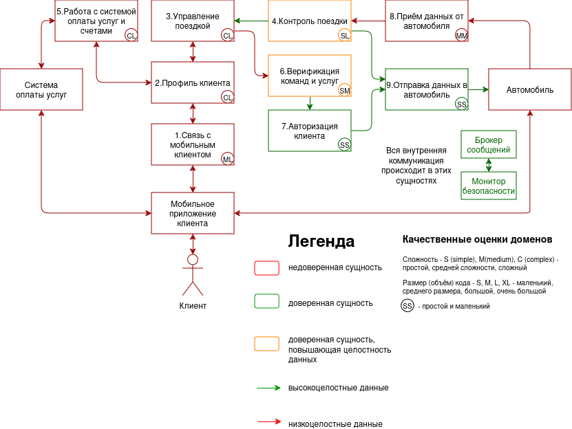


Базовая диаграмма последовательности

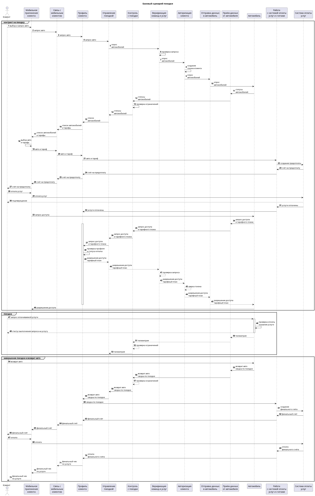

|Компонент|Назначение|
|:--|:--|
|1. Связь с мобильным клиентом|Отвечает за взаимодействие с мобильным приложением клиента|
|2. Профиль клиента|Ведение истории поездки клиента и его профиля|
|3. Управление поездкой|Контроль и работа с командами, услугами автомобиля|
|4. Контроль поездки|Проверяет скоростные и районные ограничения для поездки|В случае не соблюдения требований 3 раза подряд, принудительно завершает поездку клиента|
|5. Работа с системой оплаты услуг и счетами|Рассчёт стоимости поездок и предоплат, создание счёта в платежной системе|
|6. Верификация команд и услуг|Проверяет разрешенные команды и услуги запрашиваемые к исполнению|В случае если команда или услуга не проходит проверку, то пропускает их|
|7. Авторизация клиента|Создание и проверка токена клиента|Авторизации клиента в системе|
|8. Приём данных от автомобиля|Получает данные от автомобиля||
|9. Отправка данных в автомобиль|Отправляет данные в автомобиль|Передача происходит по защищенном каналу связи|

### Алгоритм работы решения

### Описание Сценариев (последовательности выполнения операций), при которых ЦБ нарушаются

Нарушение ЦБ (Целей безопасности) в базовом решении

Напоминание ЦБ:

1. При любых обстоятельствах поездки осуществляются только авторизованными клиентами
2. При любых обстоятельствах используются только авторизованные услуги
3. При любых обстоятельствах клиентами используются только авторизованные команды
4. При любых обстоятельствах поездки осуществляются с соблюдением скоростных ограничений
5. При любых обстоятельствах поездки осуществляются только в пределах авторизованных районов оказания услуг

|Атакованный компонент|ЦБ1|ЦБ2|ЦБ3|ЦБ4|ЦБ5|Кол-во нарушений|
|:--|:-:|:-:|:-:|:-:|:-:|:-:|
|1. Связь с мобильным клиентом|🟢|🟢|🟢|🟢|🟢|0/5|
|2. Профиль клиента|🟢|🟢|🟢|🟢|🟢|0/5|
|3. Управление поездкой|🟢|🟢|🟢|🟢|🟢|0/5|
|4. Контроль поездки|🟢|🟢|🟢|🔴|🔴|2/5|
|5. Работа с системой оплаты услуг и счетами|🟢|🔴|🟢|🟢|🟢|1/5|
|6. Верификация команд и услуг|🟢|🟢|🟢|🔴|🔴|2/5|
|7. Авторизация клиента|🟢|🟢|🟢|🟢|🟢|0/5|
|8. Приём данных от автомобиля|🟢|🟢|🟢|🔴|🔴|2/5|
|9. Отправка данных в автомобиль|🔴|🔴|🔴|🔴|🔴|5/5|

🟢 - ЦБ не нарушена 🔴 - ЦБ нарушена

#### Таблица доверенных компонентов

|Компонент|Уровень доверия|Обоснование|Комментарий|
|:--|:--|:--|:--|
|1. Связь с мобильным клиентом|$\textcolor{red}{\textsf{Недоверенный}}$|||
|2. Профиль клиента|$\textcolor{red}{\textsf{Недоверенный}}$|||
|3. Управление поездкой|$\textcolor{red}{\textsf{Недоверенный}}$|||
|4. Контроль поездки|$\textcolor{orange}{\textsf{Доверенный}}$|Соблюдение ЦБ 2, 3||
|5. Работа с системой оплаты услуг и счетами|$\textcolor{red}{\textsf{Недоверенный}}$|||
|6. Верификация команд и услуг|$\textcolor{orange}{\textsf{Доверенный}}$|Соблюдение ЦБ 4, 5||
|7. Авторизация клиента|$\textcolor{green}{\textsf{Доверенный}}$|Соблюдение ЦБ 1||
|8. Приём данных от автомобиля|$\textcolor{red}{\textsf{Недоверенный}}$|||
|9. Отправка данных в автомобиль|$\textcolor{green}{\textsf{Доверенный}}$|Соблюдение ЦБ 1, 2, 3, 4, 5||

#### Качественная оценка доменов

|Компонент|Уровень доверия|Оценка|Кол-во входящих интерфейсов|Комментарий|
|:--|:-:|:-:|:-:|:--|
|1. Связь с мобильным клиентом|$\textcolor{red}{\textsf{Недоверенный}}$|ML|2||
|2. Профиль клиента|$\textcolor{red}{\textsf{Недоверенный}}$|CL|3||
|3. Управление поездкой|$\textcolor{red}{\textsf{Недоверенный}}$|CL|2||
|4. Контроль поездки|$\textcolor{orange}{\textsf{Доверенный}}$|SL|1||
|5. Работа с системой оплаты услуг и счетами|$\textcolor{red}{\textsf{Недоверенный}}$|CL|2||
|6. Верификация команд и услуг|$\textcolor{orange}{\textsf{Доверенный}}$|SM|1|Проверка команд по whitelist|
|7. Авторизация клиента|$\textcolor{green}{\textsf{Доверенный}}$|SS|1|Создание уникальных токенов клиента и сверка его с последующими запросами|
|8. Приём данных от автомобиля|$\textcolor{red}{\textsf{Недоверенный}}$|MM|1||
|9. Отправка данных в автомобиль|$\textcolor{green}{\textsf{Доверенный}}$|SL|2|Отправка данных или команд по защищенному каналу связи|


### Проверка негативных сценариев

|Название сценария|Описание|
|---|---------|
|НС-1|Тест Негативного сценария 1. Модуль управления автомобилем скомпроментирован, но так как ввёден модуль контроля поездки и он отслеживает скоростной режим и границы авторизированного района и в случае нарушения завершает поездку (завершение поездки не нарушает ЦБ), ЦБ не нарушаются|

**Негативный сценарий - НС-1:**

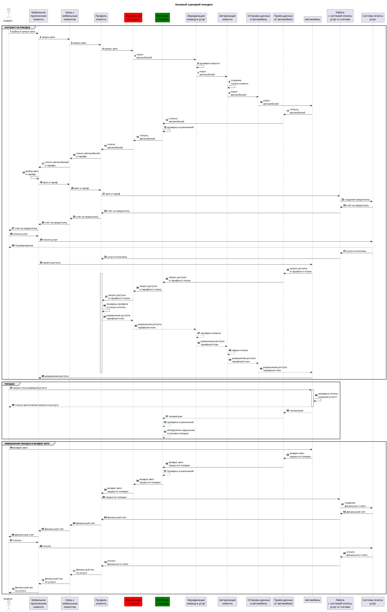

## Переработанная архитектура

Полная версия с указанием доверенных компонент


Схематичная версия

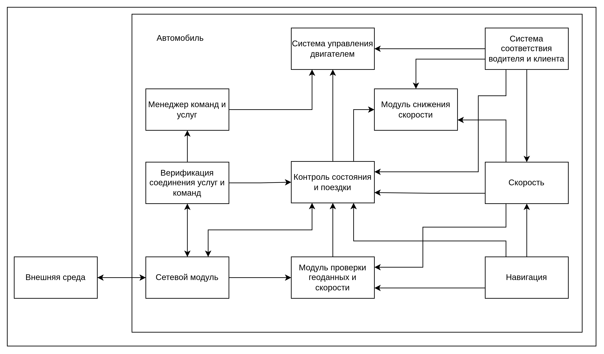

Модули 14, 15, 27, 28, 29 показывают схематичную реализацию и управление способами торможения, услугами и командами, поэтому далее и в реализации данных компонентов не будет

Версия без данных модулей

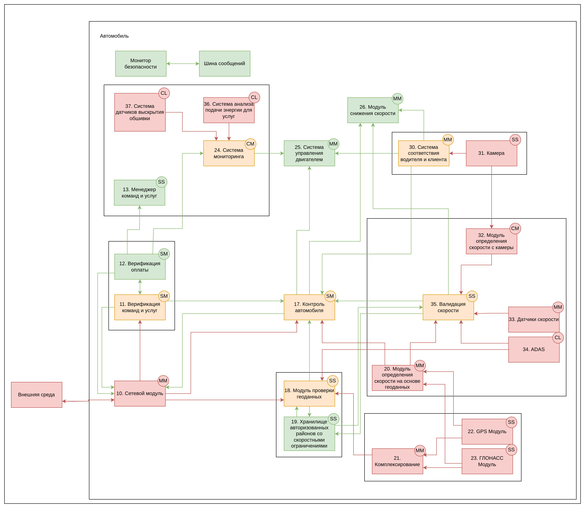

### Диаграмма последовательности

#### Выполнение базового сценария

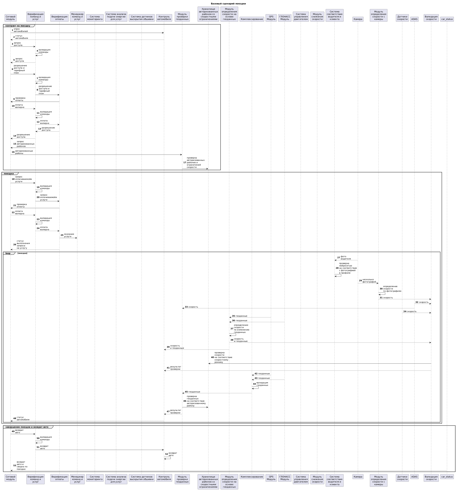

### Таблица компонентов

|Компонент|Описание|Комментарий|
|:---|:--|:--|
|10. Сетевой модуль|Получает и отправляет запросы на систему управления парком, мобильное приложение клиента и систему оплаты услуг||
|11. Верификация команд и услуг|Проверяет разрешенные команды и услуги запрашиваемые к исполнению, если команда требует проверки оплаты, то делает запрос в `12. Верификация оплаты`|В случае если команда или услуга не проходит проверку, то пропускает их|
|12. Верификация оплаты|Делает дополнительный запрос в `систему оплаты услуг` и сверяет полученные данные от `системы управления парком` и `системы оплаты услуг`|В случае если проверка не проходит, то пропускает команды и услуги|
|13. Менеджер команд и услуг|Управляет командами и услугами||
|17. Контроль автомобиля|Осуществляет основной контроль за критическими ситуациями|При получении информации о том, что автомобиль покидает авторизованную зону или начинает превышать скорость - передает запрос на `26. Модуль снижения скорости` и `25. Система управления двигателем`|
|18. Модуль проверки геоданных|Занимается сверкой текущих геоданных с авторизованной зоной|Дополнительно перед началом поездки получает актуальные авторизованные районы с `системы управления парком`, сверяя их с локальными данными. Если автомобиль выезжает из авторизованного района, то передается сообщение в `17. Контроль автомобиля`|
|19. Хранилище авторизованных районов со скоростными ограничениями|Локально хранит авторизованные зоны и скоростные ограничения||
|20. Модуль определения скорости на основе геоданных|Определяет алгоритмом скорость на основе изменения геоданных||
|21. Комплексирование|Алгоритмы комплексирования||
|22. GPS Модуль|GPS||
|23. ГЛОНАСС Модуль|ГЛОНАСС||
|24. Система мониторинга|Анализирует полученные данные на вопрос несанкционированного включения услуги или физического вмешательства|Если система понимает, что включена неавторизованная услуга, то она передает команду на `25. Система управления двигателем` выключить автомобиль|
|25. Система управления двигателем|Выключает автомобиль по команде или уменьшает подачу топлива/воздуха(вообще этот модуль и `36. Система анализа подачи энергии для услуг` подразумеваются как некоторая система питания, ее можно декомпозировать, чтоб можно было отдельно контролировать питание каждой услуги, но в качестве примера приведено только управление двигателем и анализ подачи энергии)||
|26. Модуль снижения скорости|Снижает скорость по команде|В случае если он не выполняет команды, то есть `25. Система управления двигателем`, которая может выключить двигатель|
|30. Система соответствия водителя и клиента|Нейросеть которая сравнивает каждые несколько минут фотографию водителя и фотографию клиента из личного кабинета|Если нейросеть считает, что за рулем не клиент, который оформил каршеринг, то она передает команду в `25. Система управления двигателем` выключить автомобиль|
|31. Камера|Делает фотографии и отправляет в `26. Модуль снижения скорости` и в `32. Модуль определения скорости с камеры`||
|32. Модуль определения скорости с камеры|Определяет скорость по набору фотографий с камеры(предполагается что в объектив камеры попадает часть улицы со стороны водителя)||
|33. Датчики скорости|Считывают скорость||
|34. ADAS|Усовершенствованная система помощи водителю||
|35. Валидация скорости|Проверка соответствия значений скорости из разных источников, а также проверка соответствия со скоростными ограничениями|Если скоростные ограничения нарушаются, то передается команда о снижении скорости в `17. Контроль автомобиля`, если спустя какое то время скорость так и не снизилась, то отправляется запрос о снижении напрямую в `26. Модуль снижения скорости`|
|36. Система анализа подачи энергии для услуг|Считывает сколько энергии тратится на услуги и передает в мониторинг||
|37. Система датчиков выскрытия обшивки|Система на случай физического вмешательства к начинке машины и прямого взаимодействия с электроникой|При вскрытии обшивки передает запрос на выключение двигателя|

### Описание Сценариев (последовательности выполнения операций), при которых ЦБ нарушаются

Дополнительно продублирую компоненты `системы управления автопарков`, потому что до переработки архитектуры автомобиля я предполагал, что при моделирование атак на компоненты `системы управления автопарков` автомобиль - это условный черный ящик, внутри которого мы не особо понимаем что вообще происходит. После перепроектирования архитектуры `авто` исправились нарушенные ЦБ `системы управления автопарков`


Нарушение ЦБ (Целей безопасности)

Напоминание ЦБ:

1. При любых обстоятельствах поездки осуществляются только авторизованными клиентами
2. При любых обстоятельствах используются только авторизованные услуги
3. При любых обстоятельствах клиентами используются только авторизованные команды
4. При любых обстоятельствах поездки осуществляются с соблюдением скоростных ограничений
5. При любых обстоятельствах поездки осуществляются только в пределах авторизованных районов оказания услуг

|Атакованный компонент|ЦБ1|ЦБ2|ЦБ3|ЦБ4|ЦБ5|Кол-во нарушений|
|:--|:-:|:-:|:-:|:-:|:-:|:-:|
|1. Связь с мобильным клиентом|🟢|🟢|🟢|🟢|🟢|0/5|
|2. Профиль клиента|🟢|🟢|🟢|🟢|🟢|0/5|
|3. Управление поездкой|🟢|🟢|🟢|🟢|🟢|0/5|
|4. Контроль поездки|🟢|🟢|🟢|🟢|🟢|0/5|
|5. Работа с системой оплаты услуг и счетами|🟢|🟢|🟢|🟢|🟢|0/5|
|6. Верификация команд и услуг|🟢|🟢|🟢|🟢|🟢|0/5|
|7. Авторизация клиента|🟢|🟢|🟢|🟢|🟢|0/5|
|8. Приём данных от автомобиля|🟢|🟢|🟢|🟢|🟢|0/5|
|9. Отправка данных в автомобиль|🟢|🟢|🟢|🟢|🟢|0/5|
|10. Сетевой модуль|🟢|🟢|🟢|🟢|🟢|0/5|
|11. Верификация команд и услуг|🟢|🟢|🟢|🟢|🟢|0/5|
|12. Верификация оплаты|🟢|🔴|🔴|🟢|🟢|2/5|
|13. Менеджер команд и услуг|🟢|🟢|🟢|🟢|🟢|0/5|
|17. Контроль автомобиля|🟢|🟢|🟢|🟢|🟢|0/5|
|18. Модуль проверки геоданных|🟢|🟢|🟢|🟢|🟢|0/5|
|19. Хранилище авторизованных районов со скоростными ограничениями|🟢|🟢|🟢|🔴|🔴|2/5|
|20. Модуль определения скорости на основе геоданных|🟢|🟢|🟢|🟢|🟢|0/5|
|21. Комплексирование|🟢|🟢|🟢|🟢|🟢|0/5|
|22. GPS Модуль|🟢|🟢|🟢|🟢|🟢|0/5|
|23. ГЛОНАСС Модуль|🟢|🟢|🟢|🟢|🟢|0/5|
|24. Система мониторинга|🟢|🔴|🔴|🟢|🟢|2/5|
|25. Система управления двигателем|🟢|🟢|🟢|🟢|🟢|0/5|
|26. Модуль снижения скорости|🟢|🟢|🟢|🟢|🟢|0/5|
|30. Система соответствия водителя и клиента|🟢|🔴|🟢|🟢|🟢|1/5|
|31. Камера|🟢|🔴|🟢|🟢|🟢|1/5|
|32. Модуль определения скорости с камеры|🟢|🟢|🟢|🟢|🟢|0/5|
|33. Датчики скорости|🟢|🟢|🟢|🟢|🟢|0/5|
|34. ADAS|🟢|🟢|🟢|🟢|🟢|0/5|
|35. Валидация скорости|🟢|🟢|🟢|🟢|🔴|1/5|
|36. Система анализа подачи энергии для услуг|🟢|🔴|🔴|🟢|🟢|2/5|
|37. Система датчиков выскрытия обшивки|🟢|🟢|🟢|🟢|🟢|0/5|

🟢 - ЦБ не нарушена 🔴 - ЦБ нарушена

#### Таблица доверенных компонентов

|Компонент|Уровень доверия|Обоснование|Комментарий|
|:--|:--|:--|:--|
|1. Связь с мобильным клиентом|$\textcolor{red}{\textsf{Недоверенный}}$|||
|2. Профиль клиента|$\textcolor{red}{\textsf{Недоверенный}}$|||
|3. Управление поездкой|$\textcolor{red}{\textsf{Недоверенный}}$|||
|4. Контроль поездки|$\textcolor{orange}{\textsf{Доверенный}}$|Соблюдение ЦБ 2, 3||
|5. Работа с системой оплаты услуг и счетами|$\textcolor{red}{\textsf{Недоверенный}}$|||
|6. Верификация команд и услуг|$\textcolor{orange}{\textsf{Доверенный}}$|Соблюдение ЦБ 4, 5||
|7. Авторизация клиента|$\textcolor{green}{\textsf{Доверенный}}$|Соблюдение ЦБ 1||
|8. Приём данных от автомобиля|$\textcolor{red}{\textsf{Недоверенный}}$|||
|9. Отправка данных в автомобиль|$\textcolor{green}{\textsf{Доверенный}}$|Соблюдение ЦБ 1, 2, 3, 4, 5||
|10. Сетевой модуль|$\textcolor{red}{\textsf{Недоверенный}}$|||
|11. Верификация команд и услуг|$\textcolor{orange}{\textsf{Доверенный}}$|Соблюдение ЦБ 1, 2, 3||
|12. Верификация оплаты|$\textcolor{green}{\textsf{Доверенный}}$|Соблюдение ЦБ 1, 2||
|13. Менеджер команд и услуг|$\textcolor{green}{\textsf{Доверенный}}$|Соблюдение ЦБ 2, 3||
|16. Модуль состояния автомобиля|$\textcolor{red}{\textsf{Недоверенный}}$|||
|17. Контроль автомобиля|$\textcolor{orange}{\textsf{Доверенный}}$|Соблюдение ЦБ 1, 4, 5||
|18. Модуль проверки геоданных|$\textcolor{orange}{\textsf{Доверенный}}$|Соблюдение ЦБ 4, 5||
|19. Хранилище авторизованных районов со скоростными ограничениями|$\textcolor{green}{\textsf{Доверенный}}$|Соблюдение ЦБ 4, 5||
|20. Модуль определения скорости на основе геоданных|$\textcolor{red}{\textsf{Недоверенный}}$|||
|21. Комплексирование|$\textcolor{red}{\textsf{Недоверенный}}$|||
|22. GPS Модуль|$\textcolor{red}{\textsf{Недоверенный}}$|||
|23. ГЛОНАСС Модуль|$\textcolor{red}{\textsf{Недоверенный}}$|||
|24. Система мониторинга|$\textcolor{orange}{\textsf{Доверенный}}$|Соблюдение ЦБ 2, 3||
|25. Система управления двигателем|$\textcolor{green}{\textsf{Доверенный}}$|Соблюдение ЦБ 1, 2, 3, 4, 5||
|26. Модуль снижения скорости|$\textcolor{green}{\textsf{Доверенный}}$|Соблюдение ЦБ 4, 5||
|30. Система соответствия водителя и клиента|$\textcolor{orange}{\textsf{Доверенный}}$|Соблюдение ЦБ 1||
|31. Камера|$\textcolor{red}{\textsf{Недоверенный}}$|||
|32. Модуль определения скорости с камеры|$\textcolor{red}{\textsf{Недоверенный}}$|||
|33. Датчики скорости|$\textcolor{red}{\textsf{Недоверенный}}$|||
|34. ADAS|$\textcolor{red}{\textsf{Недоверенный}}$|||
|35. Валидация скорости|$\textcolor{orange}{\textsf{Доверенный}}$|Соблюдение ЦБ 4, 5||
|36. Система анализа подачи энергии для услуг|$\textcolor{red}{\textsf{Недоверенный}}$|||
|37. Система датчиков выскрытия обшивки|$\textcolor{red}{\textsf{Недоверенный}}$|||

#### Качественная оценка доменов

|Компонент|Уровень доверия|Оценка|Кол-во входящих интерфейсов|Кол-во выходящих интерфейсов|Комментарий|
|:--|:-:|:-:|:-:|:-:|:--|
|1. Связь с мобильным клиентом|$\textcolor{red}{\textsf{Недоверенный}}$|ML|2|2||
|2. Профиль клиента|$\textcolor{red}{\textsf{Недоверенный}}$|CL|3|3||
|3. Управление поездкой|$\textcolor{red}{\textsf{Недоверенный}}$|CL|2|2||
|4. Контроль поездки|$\textcolor{orange}{\textsf{Доверенный}}$|SL|1|2|Проверка на соответствие геоданных авто с авторизованными районами|
|5. Работа с системой оплаты услуг и счетами|$\textcolor{red}{\textsf{Недоверенный}}$|CL|2|2||
|6. Верификация команд и услуг|$\textcolor{orange}{\textsf{Доверенный}}$|SM|1|1|Проверка команд по whitelist|
|7. Авторизация клиента|$\textcolor{green}{\textsf{Доверенный}}$|SS|1|1|Создание уникальных токенов клиента и сверка его с последующими запросами|
|8. Приём данных от автомобиля|$\textcolor{red}{\textsf{Недоверенный}}$|MM|1|1||
|9. Отправка данных в автомобиль|$\textcolor{green}{\textsf{Доверенный}}$|SL|2|1|Отправка данных или команд по защищенному каналу связи|
|10. Сетевой модуль|$\textcolor{red}{\textsf{Недоверенный}}$|MM|4|4||
|11. Верификация команд и услуг|$\textcolor{orange}{\textsf{Доверенный}}$|SM|2|3|Проверка команд по whitelist|
|12. Верификация оплаты|$\textcolor{green}{\textsf{Доверенный}}$|SM|1|4|Запрос в систему оплаты услуг для проверки системы управления автопарком|
|13. Менеджер команд и услуг|$\textcolor{green}{\textsf{Доверенный}}$|SS|1|0||
|17. Контроль автомобиля|$\textcolor{orange}{\textsf{Доверенный}}$|SM|6|3|Повторная проверка и скорости и геоданных|
|18. Модуль проверки геоданных|$\textcolor{orange}{\textsf{Доверенный}}$|SS|4|2|Проверка на соответствие геоданных авто с авторизованными районами|
|19. Хранилище авторизованных районов со скоростными ограничениями|$\textcolor{green}{\textsf{Доверенный}}$|SS|2|2||
|20. Модуль определения скорости на основе геоданных|$\textcolor{red}{\textsf{Недоверенный}}$|MM|2|2||
|21. Комплексирование|$\textcolor{red}{\textsf{Недоверенный}}$|MM|2|1||
|22. GPS Модуль|$\textcolor{red}{\textsf{Недоверенный}}$|SS|0|2||
|23. ГЛОНАСС Модуль|$\textcolor{red}{\textsf{Недоверенный}}$|SS|0|2||
|24. Система мониторинга|$\textcolor{orange}{\textsf{Доверенный}}$|CM|3|1|Анализирует энергопотребление услуг и физической целостности авто|
|25. Система управления двигателем|$\textcolor{green}{\textsf{Доверенный}}$|MM|3|0|При необходимости снижает скорость или останавливает авто|
|26. Модуль снижения скорости|$\textcolor{green}{\textsf{Доверенный}}$|MM|3|0|При необходимости снижает скорость или останавливает авто|
|30. Система соответствия водителя и клиента|$\textcolor{orange}{\textsf{Доверенный}}$|MM|1|3|Проверка по фото на соответствие водителя и клиента арендовавшего авто|
|31. Камера|$\textcolor{red}{\textsf{Недоверенный}}$|SS|0|2||
|32. Модуль определения скорости с камеры|$\textcolor{red}{\textsf{Недоверенный}}$|CM|1|1||
|33. Датчики скорости|$\textcolor{red}{\textsf{Недоверенный}}$|MM|0|1||
|34. ADAS|$\textcolor{red}{\textsf{Недоверенный}}$|CL|0|2||
|35. Валидация скорости|$\textcolor{orange}{\textsf{Доверенный}}$|SS|5|3|Проверка на соответствие скорости авто со скоростными ограничениями|
|36. Система анализа подачи энергии для услуг|$\textcolor{red}{\textsf{Недоверенный}}$|CL|0|1||
|37. Система датчиков выскрытия обшивки|$\textcolor{red}{\textsf{Недоверенный}}$|CL|0|1||


### Проверка негативных сценариев

|Название сценария|Описание|Идеи по исправлению|
|---|---------|---------|
|НС-1|Тест Негативного сценария 1. Верификация оплаты скомпрометирована, пропуск обязательных проверок, нарушаются ЦБ 2,3||

**Негативный сценарий - НС-1:**

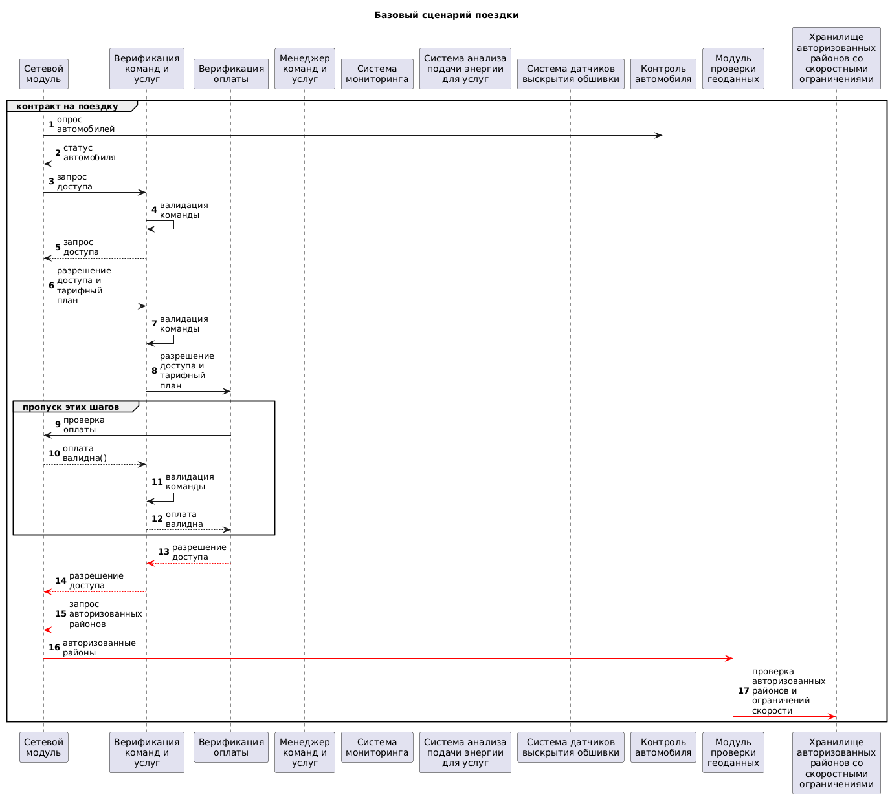

|Название сценария|Описание|Идеи по исправлению|
|---|---------|---------|
|НС-2|Тест Негативного сценария 2. Хранилище авторизованных районов со скоростными ограничениями скомпрометированно, пропуск обязательных проверок, нарушаются ЦБ 4,5|Можно дополнитьно независимо от этих проверок отправлять напрямую с датчиков геоданные, чтоб сервер мог понять, что стоит вмешаться|

**Негативный сценарий - НС-2:**

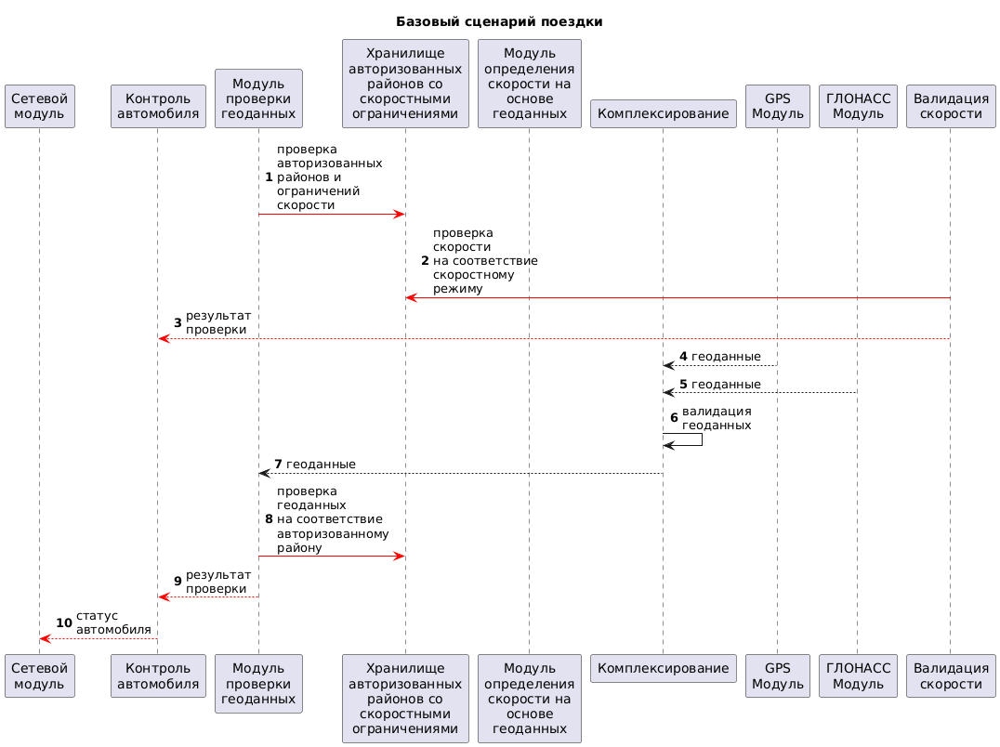

|Название сценария|Описание|Идеи по исправлению|
|---|---------|---------|
|НС-3|Тест Негативного сценария 3. Камера или Система соответствия водителя и клиента скомпрометированна, невозможность определить за рулем сейчас клиент, или он поменялся или кто то оформил каршеринг через чужой аккаунт, нарушаются ЦБ 1|Можно дополнитьно проверять какими нибудь голосовыми командами, просить селфи прислать или запись голоса фразы с экрана, идей таких достаточно, но вот только они никогда не дадут 100% защиту, максимум - усложнят|

**Негативный сценарий - НС-3:**

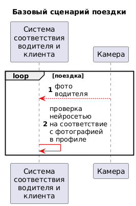

|Название сценария|Описание|Идеи по исправлению|
|---|---------|---------|
|НС-4|Тест Негативного сценария 4. Система валидации скорости скомпрометированна, невозможность может повлечь превышения скоростных ограничений, нарушаются ЦБ 4|Точно также как и с геоданными отдельно отправлять на сервер и принимать аварийные команды на остановку или снижение скорости|

**Негативный сценарий - НС-4:**

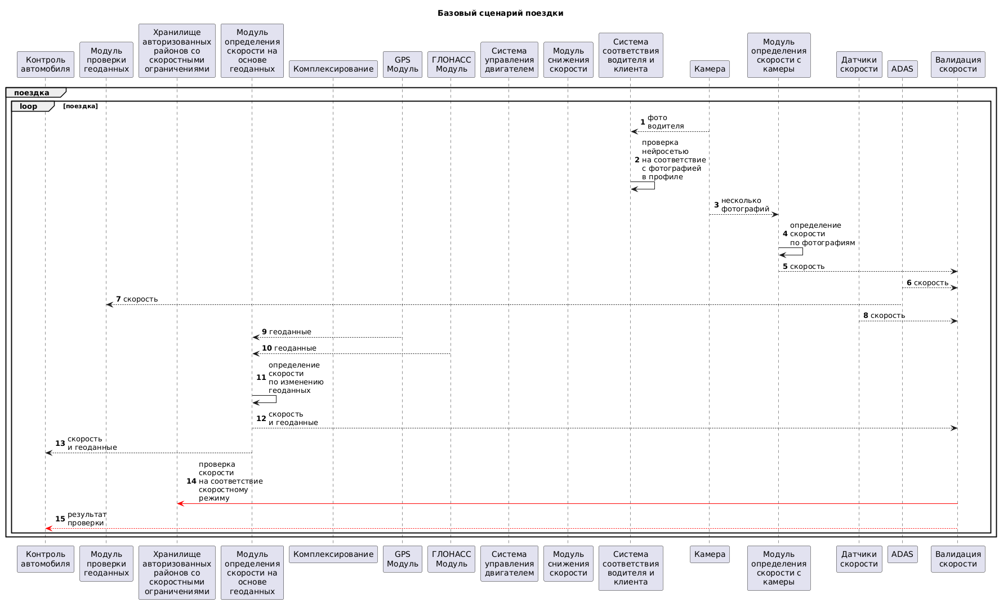

|Название сценария|Описание|
|---|---------|
|ПС-1|Тест Позитивного сценария 1. Кто то захотел отправить неавторищованную команду, но мы спокойно ее проверяем в верификации команд и услуг|

**Позитивный сценарий - ПС-1:**

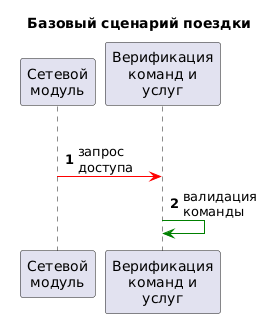

|Название сценария|Описание|
|---|---------|
|ПС-2|Тест Позитивного сценария 2. Кто то взломал сервер и говорит что он оплатил услугу, но мы спрашиваем у сервиса, через который проходит оплата(система оплаты услуг) и понимаем, что никакой оплаты не было!|

**Позитивный сценарий - ПС-2:**

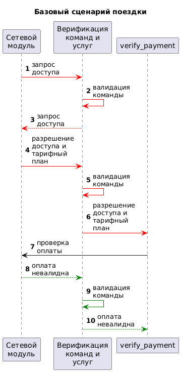

### Политики безопасности

|Компонент|Соответствие|
|-----|-----|
|Система управления автопарком|managment-system|
|Система оплаты услуг|payment-system|
|Мобильное приложение клиента|mobile-client|
|Монитор безопасности|car-monitor|
|10. Сетевой модуль|car-network|
|11. Верификация команд и услуг|car-verify-service|
|12. Верификация оплаты|car-verify-payment|
|13. Менеджер команд и услуг|car-manager-service|
|17. Контроль автомобиля|car-control|
|18. Модуль проверки геоданных|car-verify-geodata|
|19. Хранилище авторизованных районов со скоростными ограничениями|car-data|
|20. Модуль определения скорости на основе геоданных|car-get-speed-from-geo|
|21. Комплексирование|car-complex|
|22. GPS Модуль|car-gps|
|23. ГЛОНАСС Модуль|car-glonass|
|24. Система мониторинга|car-monitoring|
|25. Система управления двигателем|car-engine|
|26. Модуль снижения скорости|car-speed-lower|
|30. Система соответствия водителя и клиента|car-verify-driver|
|31. Камера|car-camera|
|32. Модуль определения скорости с камеры|car-get-speed-from-camera|
|33. Датчики скорости|car-speed-sensors|
|34. ADAS|car-adas|
|35. Валидация скорости|car-verify-speed|
|36. Система анализа подачи энергии для услуг|car-energy|
|37. Система датчиков выскрытия обшивки|car-skin-sersors|

```python {lineNo:true}
policies = (
    # dst car-network
    {"src": "car-verify-service", "dst": "car-network"},
    {"src": "car-verify-payment", "dst": "car-network"},
    {"src": "car-control", "dst": "car-network"},

    # dst car-verify-service
    {"src": "car-network", "dst": "car-verify-service"},
    {"src": "car-verify-payment", "dst": "car-verify-service"},

    # dst car-verify-payment
    {"src": "car-verify-service", "dst": "car-verify-payment"},

    # dst car-manager-service
    {"src": "car-verify-payment", "dst": "car-manager-service"},

    # dst car-control
    {"src": "car-network", "dst": "car-control"},
    {"src": "car-verify-service", "dst": "car-control"},
    {"src": "car-verify-geodata", "dst": "car-control"},
    {"src": "car-get-speed-from-geo", "dst": "car-control"},
    {"src": "car-verify-speed", "dst": "car-control"},
    {"src": "car-verify-driver", "dst": "car-control"},
    
    # dst car-verify-geodata
    {"src": "car-complex", "dst": "car-verify-geodata"},
    {"src": "car-network", "dst": "car-verify-geodata"},
    {"src": "car-adas", "dst": "car-verify-geodata"},
    {"src": "data", "dst": "car-verify-geodata"},

    # dst car-data
    {"src": "car-verify-geodata", "dst": "car-data"},
    {"src": "car-verify-speed", "dst": "car-data"},

    # dst car-get-speed-from-geo
    {"src": "car-gps", "dst": "car-get-speed-from-geo"},
    {"src": "car-glonass", "dst": "car-get-speed-from-geo"},
    
    # dst car-complex
    {"src": "car-gps", "dst": "car-complex"},
    {"src": "car-glonass", "dst": "car-complex"},

    # dst car-gps
    # 0    
    
    # dst car-glonass
    # 0   
    
    # dst car-monitoring
    {"src": "car-verify-payment", "dst": "car-monitoring"},
    {"src": "car-energy", "dst": "car-monitoring"},
    {"src": "car-skin-sensors", "dst": "car-monitoring"},
    
    # dst car-engine
    {"src": "car-monitoring", "dst": "car-engine"},
    {"src": "car-control", "dst": "car-engine"},
    {"src": "car-verify-driver", "dst": "car-engine"},
    
    # dst car-speed-lower
    {"src": "car-verify-speed", "dst": "car-speed-lower"},
    {"src": "car-control", "dst": "car-speed-lower"},
    {"src": "car-verify-driver", "dst": "car-speed-lower"},
    
    # dst car-verify-driver
    {"src": "car-camera", "dst": "car-verify-driver"},

    # dst car-camera
    # 0   
    
    # dst car-get-speed-from-camera
    {"src": "car-camera", "dst": "car-get-speed-from-camera"},
    
    # dst car-speed-sensors
    # 0  
    
    # dst car-adas
    # 0  
    
    # dst car-verify-speed
    {"src": "car-get-speed-from-camera", "dst": "car-verify-speed"},
    {"src": "car-speed-sensors", "dst": "car-verify-speed"},
    {"src": "car-adas", "dst": "car-verify-speed"},
    {"src": "car-get-speed-from-geo", "dst": "car-verify-speed"},
    {"src": "car-data", "dst": "car-verify-speed"}
    
    # dst car-energy
    # 0  
    
    # dst car-skin-sensors
    # 0  
)


def check_operation(id, details) -> bool:
    """ Проверка возможности совершения обращения. """
    src: str = details.get("source")
    dst: str = details.get("deliver_to")

    if not all((src, dst)):
        return False

    print(f"[info] checking policies for event {id}, {src}->{dst}")

    return {"src": src, "dst": dst} in policies

```

## Запуск приложения и тестов

### Запуск приложения

см. [инструкцию по запуску](../README.md)

### Запуск тестов

[ссылка на запись выполненных тестов на моей машине](https://drive.google.com/file/d/1dJ90oeWFtq55z_hzlTyreBe-QNgGLIKw/view?usp=sharing)

скриншоты выполненных тестов

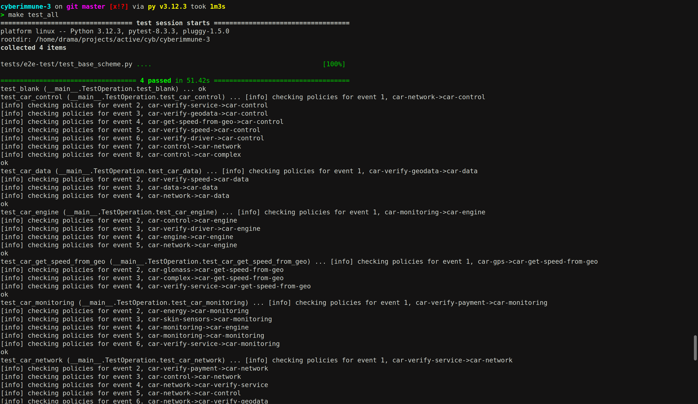

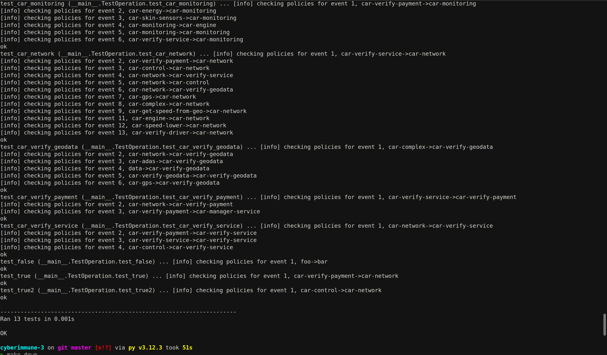

_Предполагается, что в ходе подготовки рабочего места все системные пакеты были установлены._

Запуск примера: открыть окно терминала в Visual Studio code, в папке с исходным кодом выполнить

Для запуска

```sh
make all
```

тестирование (будут запущен e2e тест и потом security)

```sh
make test
```

запуск всех тестов

```sh
make test_all
```

тестирование e2e

```sh
make test_e2e
```

тестирование политик безопасности

```sh
make test_security
```


