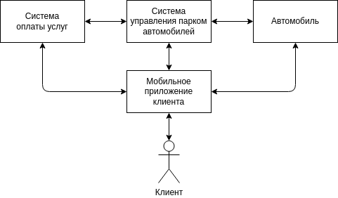
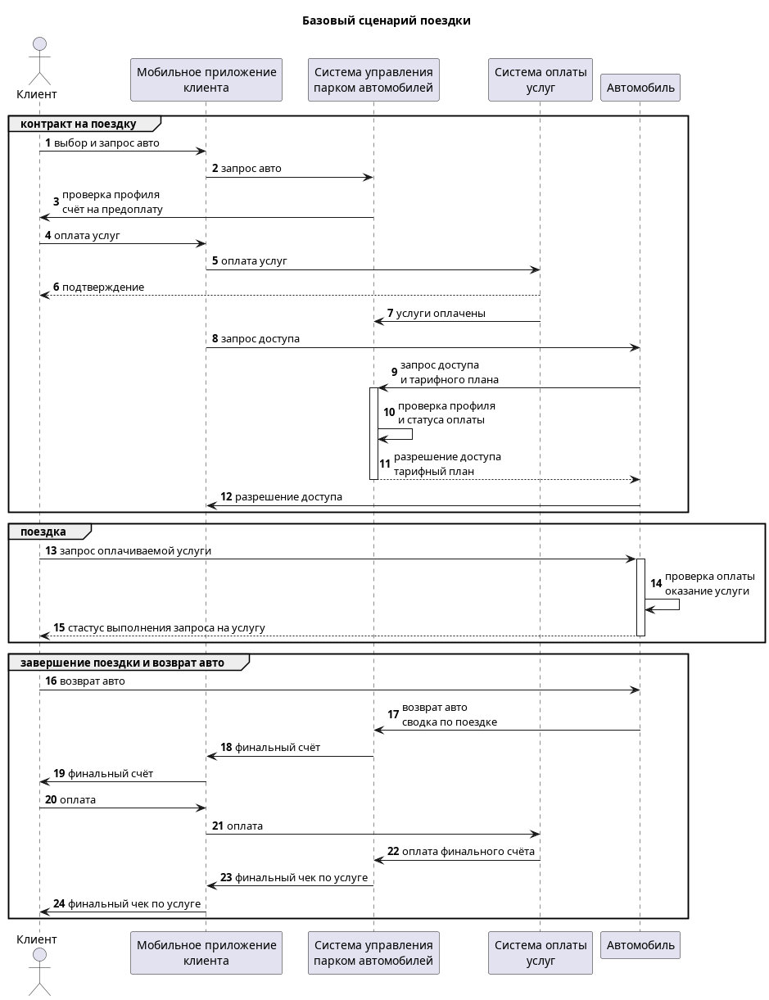

# Задача для кибериммунного хакатона 3.0 (осень 2024)

## Краткая формулировка задачи

Компания разрабатывает подсистему удалённого управления ключевыми функциями для нового легкового автомобиля. Основной сценарий эксплуатации - каршэринг - совместное использование автомобиля широким кругом лиц, которые оплачивают подписку на различные наборы сервисов.

Необходимо обеспечить гибкое управление функционалом автомобиля таким образом,
чтобы только аутентичный и авторизованный пользователь мог управлять автомобилем
в соответствии со своей подпиской.

Отдельные функции, такие как, например, принудительная блокировка двигателя, отключение освещения, могут привести к аварии и ущербу для жизни и здоровья пассажиров в случае если это происходит во время движения.

Программного обеспечения в системе становится критически много, а сроки разработки
сжатые, производителю необходимо выпустить свой автомобиль на рынок быстрее
конкурентов, чтобы захватить большую долю рынка.

Необходимо **спроектировать систему удалённого управления** устойчивой к атакам
как снаружи, так и изнутри системы, чтобы снизить требования к производителям
сторонних подсистем и собственным разработчикам - это позволит ускорить и
удешевить процесс разработки.

# Полезная информация для участников

## Критерии оценки решений

1. Наличие отчёта в markdown или drawio формате с описанием архитектуры решения и кода. \
При наличии работающего кода, реализующего предложенную архитектуру - описание как запустить и выполнить функциональный тест (если есть тесты безопасности - как выполнить их). \
*Пожалуйста, обязательно проверьте версию, которую вы отправляете для оценки! Она должна запускаться и работать согласно вашему описанию! Опечатки и ошибки в коде, которые не позволят запустить код и тесты помешают жюри оценить вашу работу по достоинству.*
2. Функционал - заявленная в условиях задачи последовательность выполнения функций должна выполняться. Как на уровне диаграммы последовательности, так и на уровне кода.
3. Тесты безопасности (автоматические или ручные), разработанные командой
4. Первичное моделирование угроз в формате диаграмм негативных сценариев (это диаграммы последовательности с явным указанием компрометируемых компонентов и *нарушенных целей безопасности*)
5. Архитектура решения и выбор доверенных компонент - выбор должен быть обоснован (в отчёте должна быть таблица с обоснованием уровня доверия для каждого компонента, в идеале - со ссылками на результаты первичного моделирования угроз из п. 4), а объем кода и сложность доверенных компонент минимально возможными, также желательно, чтобы доверенные компоненты работали с минимально возможным количеством входящих потоков данных.

### При прочих равных преимущества получат работы, в которых

- решение на уровне архитектуры обеспечивает достижение наибольшего количества целей безопасности при качественно меньшем объёме и сложности доверенного кода (см. примечание ниже)

### Примечание

При качественной оценке размера и сложности компонентов нужно предполагать не их фактические характеристики в разработанном прототипе, а ожидаемый/предполагаемый размер в реальном продукте. \
Подсказка: можно взять один компонент за единицу размера и сложности, остальные измерять относительно него.

# Расширенное описание задачи

## Ценности и ущербы

|Ценность|Неприемлемое событие|Оценка ущерба|Комментарий|
|:--|:--|:--|:--|
|Люди-клиенты|в результате критического сбоя в системе управления пострадали клиенты|высокий||
|Другие люди|в результате критического сбоя в системе управления пострадали другие люди (пешеходы, водители других авто)|высокий||
|Автомобиль|в результате критического сбоя в системе управления пострадал автомобиль|средний|Автомобиль застрахован|
|Имущество третьих лиц|в результате критического сбоя в системе управления пострадало имущество третьих лиц / важная инфраструктура|высокий||
|Операционная прибыль|злоумышленники получили неавторизованный доступ к функциям|высокий||

# Контекстная диаграмма

# Базовый сценарий

# Цели безопасности

1. При любых обстоятельствах поездки осуществляются только авторизованными клиентами
2. При любых обстоятельствах используются только авторизованные услуги
3. При любых обстоятельствах клиентами используются только авторизованные команды
4. При любых обстоятельствах поездки осуществляются с соблюдением скоростных ограничений
5. При любых обстоятельствах поездки осуществляются только в пределах авторизованных районов оказания услуг

# Отправная точка и минимально жизнеспособное решение

Участникам будут предложены две реализации системы управления:
- целевая система как монолит + функциональные имитаторы смежных систем
- целевая система как набор микросервисов и монитор безопасности для контроля, но только некоторые из целей безопасности будут обеспечиваться